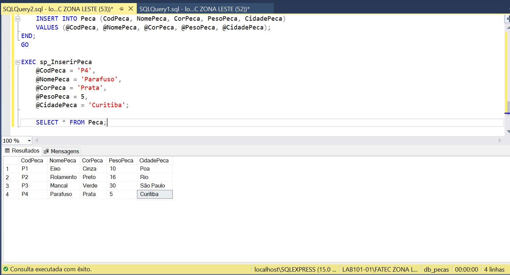
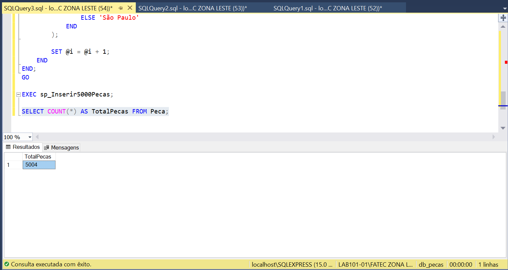

# Stored Procedure - Inserir Peça

Considerando a Lista de Exercícios da Aula de Funções Agregadas, foi criada a seguinte Stored Procedure:

**1 - Procedure para inserir um registro na tabela Peça, usando parâmetros.**

Script completo: [stored_procedure_inserir_peca.sql](stored_procedure_inserir_peca.sql)

## Resultado

---

## Questão 2

Considerando a Lista de Exercícios da Aula de Funções Agregadas, foi criada a seguinte Stored Procedure:

**2 - Procedure para inserir 5000 registros distintos na tabela Peça.**

Script completo: [stored_procedure_inserir_5000_pecas.sql](stored_procedure_inserir_5000_pecas.sql)

### Resultado

